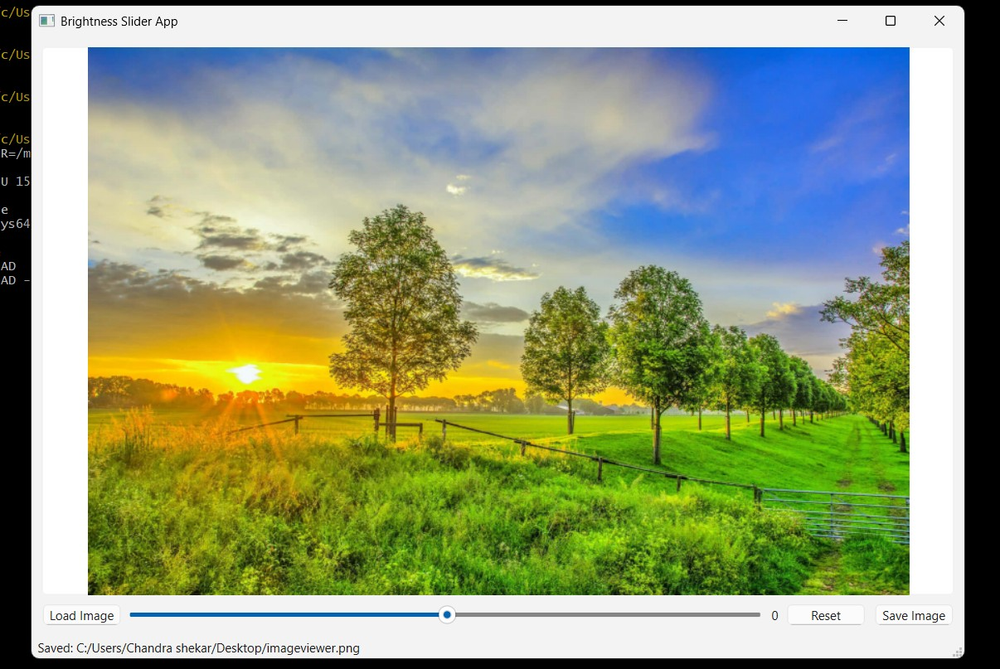
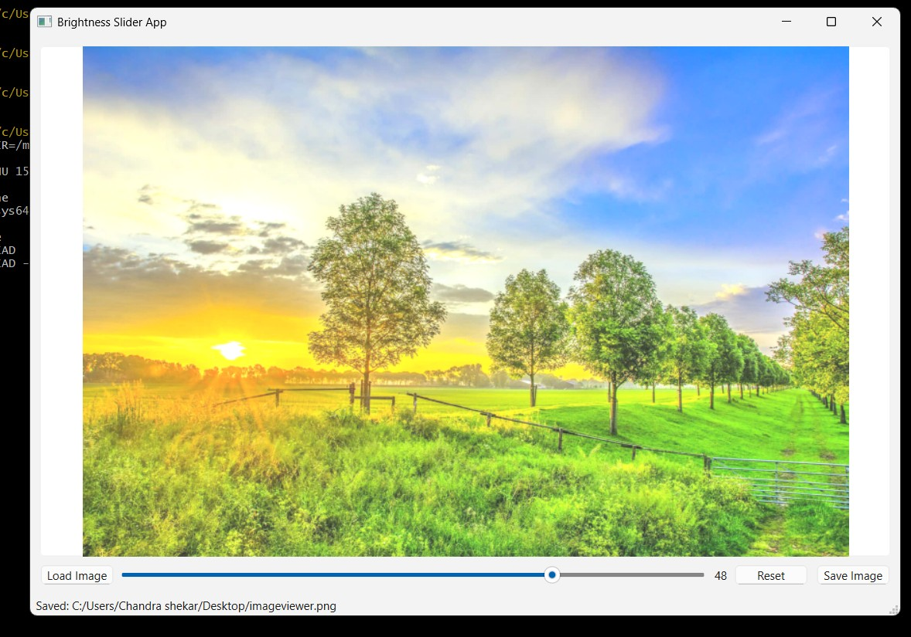

# ImageViewerApp

A simple Qt-based Image Viewer with real-time brightness adjustment using a slider.  
This project demonstrates **Qt Widgets**, **signals and slots**, and basic image processing using `QImage`/`QPixmap`.

---

## Features

- Load PNG/JPG images from disk.  
- Display default image on startup.  
- Adjust brightness in real-time with a horizontal slider (-100 to +100).  
- Reset button restores original brightness.  
- Save button saves the modified image.  
- Displays current brightness value next to the slider.  

---

## Demo Screenshots

| Original | Brightened | Darkened | Slide_Demo |
|----------|------------|----------| ----------- |
|  |  |  | | 


---

## Prerequisites

- Qt 6.x  
- CMake 3.14+  
- MinGW (Windows) or build-essential (Linux)  
- MSYS2 terminal (recommended for Windows)  

---

## Build Instructions (Windows / MSYS2)

1. Open **MSYS2 MinGW64 terminal**.  
2. Navigate to the project folder:

```bash
cd /c/Users/<YourName>/Desktop/ImageViewerApp
```
3. Create and enter a build folder:

```bash
mkdir build
cd build
``` 
4. Configure CMake with Qt paths:

```bash
cmake .. -G "MinGW Makefiles" -DQt6_DIR=/mingw64/lib/cmake/Qt6 -DQt6Widgets_DIR=/mingw64/lib/cmake/Qt6Widgets
```

5. Build the project:

```bash
cmake --build .
```


6. Run the application:

```bash
./ImageViewerApp.exe
```

## Build Instructions (Linux / Ubuntu)

```bash
sudo apt install build-essential qtbase5-dev qtchooser qt5-qmake cmake
mkdir build && cd build
cmake ..
make
./ImageViewerApp
```

## Project Structure
``` bash
ImageViewerApp/
 ├── CMakeLists.txt
 ├── main.cpp
 ├── window.h
 ├── window.cpp
 ├── default.jpg              # Default image
 ├── README.md
 └── Screenshots/             # Demo screenshots
      ├── Original_Image.jpg
      ├── Brightened_Image.jpg
      └── Darkened_Image.jpg
      └── Slider_Demo.gif
```   

## Usage

**Load Image**: Click Load Image and select a PNG/JPG.

**Adjust Brightness**: Move the slider; the value is shown next to it.

**Reset**: Click Reset to restore the original brightness.

**Save Image**: Click Save Image to save the currently displayed image.

